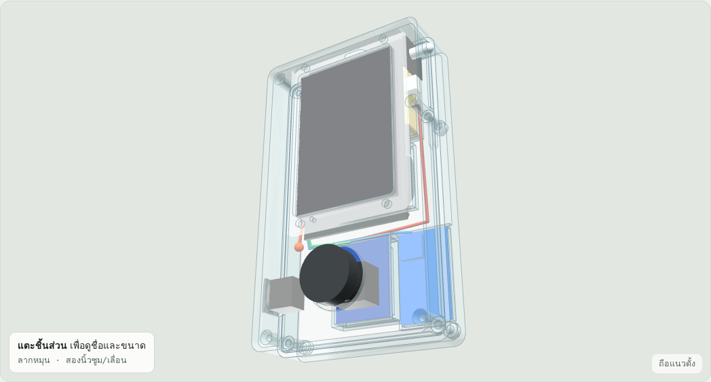
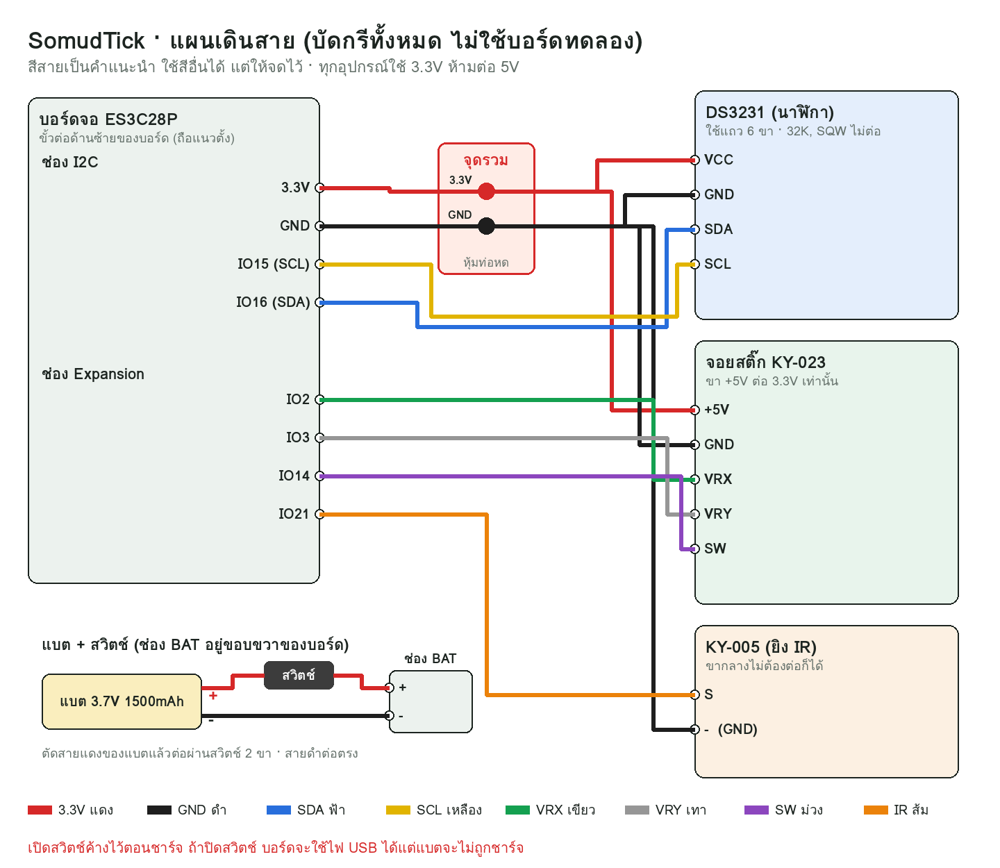

# กล่อง SomudTick (SomudTick Case)

แบบกล่องสำหรับ ES3C28P + แบต + จอยสติ๊ก + DS3231 + KY-005 + ลำโพง + สวิตช์

ทำได้ 2 ทาง ทั้งสองทางวางอุปกรณ์ตำแหน่งเดียวกันทุกชิ้น:

| ทาง | ใช้ไฟล์ | ขนาดกล่อง |
|---|---|---|
| **ก. เจาะกล่องใสใบเดิม** | `SomudTick_template_A4.pdf` (แบบเจาะขนาดจริง) | 135 × 80 × 30 มม. |
| **ข. ส่งร้านพิมพ์ 3D** | `stl/front_shell.stl` + `stl/back_shell.stl` | 136 × 81 × 31 มม. |

ดูโมเดล 3D ได้ที่ไฟล์ `somudtick_case_3d.html` เปิดในเบราว์เซอร์ (ต้องต่อเน็ต) ใช้นิ้วหมุนดู แตะชิ้นส่วนเพื่อดูชื่อและขนาด กดปุ่ม "ถือแนวนอน" หรือเลื่อน "แยกฝา" เพื่อดูข้างในได้



---

## ตำแหน่งอุปกรณ์
มองจากหน้าจอ ถือแนวตั้ง USB-C อยู่บน จอยอยู่ล่าง (ถ้าถือแนวนอน จอยจะอยู่ขวา)

| อุปกรณ์ | อยู่ตรงไหน |
|---|---|
| จอ ES3C28P | ครึ่งบน ชิดผนังบนและผนังขวา ยึดกับฝาหน้าด้วยน็อต M3 4 ตัว |
| แบต 48×30×10 | หลังจอ ด้านบน (ฝั่ง USB-C) |
| ลำโพง 40×28×10 | หลังจอ ใต้แบต หน้าลำโพงหันออกฝาหลัง |
| จอยสติ๊ก | ครึ่งล่าง ตรงกลาง ยกสูงจากฝาหลัง 6.5 มม. |
| DS3231 | ล่างขวา ข้างจอย วางราบกับฝาหลัง |
| KY-005 | มุมบนขวา หัวหลอดโผล่ออกผนังขวา (ถือแนวนอน = ขอบบนซ้าย) |
| สวิตช์ | ผนังซ้าย ใกล้จอย (ถือแนวนอน = ขอบล่างขวา) |
| จุดบัดกรีรวม 3.3V/GND | แถบว่างซ้ายของจอ ใกล้ช่อง I2C |

ภาพเทียบกับที่วาดไว้: `images/layout_vs_sketch.png`

---

## ของที่ต้องซื้อเพิ่ม
- น็อต M3 × 10 มม. จำนวน 4 ตัว (ยึดจอกับฝาหน้า ขันเข้าเสาทองเหลืองเดิม)
- ถ้าพิมพ์กล่อง: น็อต M3 × 20 มม. อีก 4 ตัว (ยึดฝาหน้ากับฝาหลัง)
- ท่อหดหุ้มสาย, เทปโฟมสองหน้า, กาวร้อน (ปืนกาว)
- ถ้าเจาะกล่องใส: ของรองสูง 6.5 มม. สำหรับจอย เช่น เสารอง M3 สูง 6 มม. 4 ตัว หรือเทปโฟมหนาซ้อนกัน

---

## ทาง ก. เจาะกล่องใสใบเดิม
⚠️ **ถอดแบตและสาย USB ออกก่อนทำทุกครั้ง**

1. **พิมพ์แบบเจาะ** `SomudTick_template_A4.pdf` บนกระดาษ A4 ตั้งค่า **"ขนาดจริง / 100%"** (ห้ามเลือก "พอดีหน้า")
   ✅ **เช็ค:** วัดไม้บรรทัดที่พิมพ์ในหน้า ต้องยาวพอดี 50 มม.
   ❌ ถ้าไม่ตรง ให้ปิดตัวเลือกย่อ/ขยายในหน้าพิมพ์ แล้วพิมพ์ใหม่
2. **ตัดกระดาษตามกรอบดำ** แล้วแปะเทปบนกล่องให้ขอบตรงกัน
   - ฝาหน้า: แปะด้านนอก ตามหัวข้อ "ฝาหน้า"
   - ฝาหลัง: แปะด้านนอก ในแบบซ้าย-ขวากลับกันไว้แล้ว ปุ่ม BOOT จะอยู่ซ้ายเมื่อมองจากหลัง
3. **ทาบจอจริงก่อน:** วางจอบนฝาหน้า เทียบรูน็อตกับหน้าต่างจอกับเส้นในกระดาษ ถ้าคลาด ให้ขีดตามของจริงแทน
   ✅ **เช็ค:** รูน็อต 4 รูต้องตรงกับรูในแผ่นอะคริลิกพอดี
   ❌ ถ้าไม่ตรง ให้จิ้มปากกาผ่านรูอะคริลิกลงบนฝาเพื่อทำจุดใหม่ (แบบในกระดาษวัดจากรูปถ่าย อาจคลาดได้ 1–2 มม.)
4. **เจาะ:** เจาะนำด้วยดอก 2 มม. ที่จุดกากบาททุกจุดก่อน แล้วค่อยขยาย
   - หน้าต่างจอ: เจาะรูที่มุมทั้ง 4 แล้วตัดเข้าหาเส้นด้วยคัตเตอร์หรือตะไบ
   - รูจอย Ø26: เจาะรูเล็กรอบวงแล้วตะไบให้กลม หรือใช้ดอกเจาะวงกลม (hole saw)
   - กล่องพลาสติกใสแตกง่าย ให้เจาะรอบต่ำและอย่ากดแรง
5. **ผนังข้าง (หน้า 2 ของแบบเจาะ):** ประกอบจอเข้าฝาหน้าก่อน แล้วเล็งตำแหน่ง USB-C กับช่อง SD ของจริงผ่านผนังใส ขยับรูตามของจริงได้เลย
   ✅ **เช็ค:** เสียบสาย USB-C ได้สุด และเสียบการ์ด SD ด้วยปลายแหนบจนได้ยินเสียงคลิก
   ❌ ถ้าเสียบ USB-C ไม่สุด แปลว่าหัวสายชนผนัง ให้ขยายรูออกรอบ ๆ อีกเล็กน้อย
6. **ประกอบ:** ทำตามลำดับหัวข้อ "ประกอบอุปกรณ์" ด้านล่าง

---

## ทาง ข. ส่งร้านพิมพ์ 3D
ส่งไฟล์ `stl/front_shell.stl` และ `stl/back_shell.stl` ให้ร้าน พร้อมบอกค่าตั้งเหล่านี้:

| ค่า | แนะนำ |
|---|---|
| วัสดุ | PETG (ทนร้อนกว่า ถ้าวางในรถ) หรือ PLA |
| ความหนาชั้น | 0.2 มม. |
| ผนัง | 3 เส้น (3 perimeters) |
| ไส้ใน | 20% |
| ซัพพอร์ต | ไม่ต้องใช้ |
| การวาง | ฝาหน้า: คว่ำหน้าจอลงถาด / ฝาหลัง: คว่ำด้านหลังลงถาด |

ขนาดชิ้น: ฝาหน้า 136 × 81 × 17 มม. ฝาหลัง 136 × 81 × 16 มม. (รวมสันกันเลื่อน) ใช้พลาสติกรวมประมาณ 65 ซม³

ข้อมูลของกล่องพิมพ์:
- ผนังหนา 2 มม. ข้างในเหลือ 132 × 77 × 27 มม. เท่ากับกล่องใส
- ฝาหลังมีขอบกั้นแบต ขอบกั้นลำโพง แท่นรองจอยสูง 6.5 มม. และขอบกั้น DS3231 ในตัว
- ฝาหลังมีสันสูง 2 มม. เสียบเข้าฝาหน้า ช่วยให้สองฝาไม่เลื่อน
- ยึดสองฝาด้วยน็อต M3 × 20 จำนวน 4 ตัว ใส่จากด้านหลัง แล้วขันเกลียวเข้าเสาของฝาหน้า เสามีรูนำ 2.7 มม. ให้น็อตทำเกลียวในพลาสติกเอง

✅ **เช็คหลังได้ชิ้นงาน:** ประกอบสองฝาเปล่า ๆ โดยยังไม่ใส่อุปกรณ์ ต้องปิดสนิท ไม่มีร่อง
❌ ถ้าปิดไม่สนิท ให้ตะไบสันของฝาหลังออกเล็กน้อย
❌ ถ้าน็อตขันไม่เข้า ให้ใช้ดอก 2.5 มม. คว้านรูในเสาของฝาหน้าก่อน อย่าขันแรงจนเสาแตก

---

## ประกอบอุปกรณ์ (ใช้กับทั้งสองแบบ)
ดูสายตามรูป `images/wiring.png`



1. **จอ:** วางจอคว่ำลงบนฝาหน้า ให้ USB-C ชิดผนังบน แล้วขันน็อต M3 × 10 จากด้านหน้าเข้าเสาทองเหลือง 4 ตัว
   ✅ **เช็ค:** มองจากหน้า เห็นจอเต็มหน้าต่างและไม่เอียง
2. **สวิตช์:** กดสวิตช์เข้าช่องที่ผนังซ้ายจนเขี้ยวล็อก ตัดสายแดงของแบต แล้วบัดกรีต่อผ่านสวิตช์ 2 ขา หุ้มท่อหด
3. **จุดรวมไฟ:** ต่อสายจากช่อง I2C ขา 3.3V และ GND มาบัดกรีรวมกับสายไฟของ DS3231, จอย และ KY-005 ที่แถบว่างซ้ายของจอ หุ้มท่อหด
   ⚠️ ทุกอุปกรณ์ต้องใช้ **3.3V เท่านั้น** ห้ามใช้ 5V จากช่อง UART
4. **DS3231:** ใส่ถ่าน CR2032 ขั้ว + หงายขึ้น แปะเทปโฟมวางราบที่ฝาหลังด้านขวาล่าง ต่อ SDA → IO16 และ SCL → IO15
5. **จอย:** ยกสูง 6.5 มม. จากฝาหลัง
   - กล่องพิมพ์: วางลงบนแท่นที่มีให้
   - กล่องใส: ใช้เสารองหรือเทปโฟมหนา
   
   ต่อ VRX → IO2, VRY → IO3, SW → IO14
   ✅ **เช็ค:** ปิดฝาแล้ว หัวจอยโผล่พ้นฝาหน้าประมาณ 7 มม. โยกได้รอบทิศโดยไม่ชนขอบรู
   ❌ ถ้าหัวจอยชนขอบรู ให้ขยายรูให้ใหญ่ขึ้น (หัวจอยบางรุ่นกว้างกว่า 25 มม.)
   ❌ ถ้าหัวจอยโผล่น้อยไป ให้เพิ่มความสูงของที่รอง
6. **KY-005:** ดัดขาหลอดให้หลอดตั้งฉากกับบอร์ด ดันหัวหลอดออกทางรูที่ผนังขวา แล้วยึดบอร์ดด้วยกาวร้อน ต่อ S → IO21, `-` → GND
7. **แบตกับลำโพง:** แปะเทปโฟมที่หลังจอ วางแบตด้านบน (ฝั่ง USB-C) และลำโพงด้านล่าง ให้หน้าลำโพงหันออกฝาหลัง
   ⚠️ อย่าให้แบตทับปุ่ม BOOT/RESET ซึ่งอยู่หลังบอร์ดชิดขอบบน
8. **ปิดฝา:** จัดสายไม่ให้โดนหนีบตรงขอบฝา แล้วปิด
   ✅ **เช็คสุดท้าย:** เปิดสวิตช์ จอติด, จอยใช้ได้ในเกม Pixel Swim, AC Remote ยิงแสงได้ (ส่องดูด้วยกล้องมือถือ), หน้า About แสดงเวลาถูกต้อง (หลังทำ v11.2)
   ❌ ถ้าจอไม่ติดเลย ให้เช็คสายแบตที่ผ่านสวิตช์ และขั้ว + / - ที่ช่อง BAT

**เรื่องชาร์จ:** เปิดสวิตช์ค้างไว้ตอนชาร์จ ถ้าปิดสวิตช์ บอร์ดจะใช้ไฟจาก USB ทำงานได้ แต่แบตจะไม่ถูกชาร์จ

**ปุ่ม BOOT/RESET:** อยู่หลังบอร์ดและหันไปทางฝาหลัง ต้องใช้คลิปหนีบกระดาษยืดตรง แหย่ผ่านรูที่ฝาหลังลึกประมาณ 15 มม. ปกติไม่ต้องใช้ เพราะอัปเดตเฟิร์มแวร์ผ่านเมนู Settings → About → Update firmware ได้อยู่แล้ว

---

## ไฟล์ในโฟลเดอร์นี้
| ไฟล์ | คืออะไร |
|---|---|
| `SomudTick_template_A4.pdf` | แบบเจาะกล่องใสขนาดจริง 2 หน้า (ฝาหน้า/หลัง, ผนังข้าง) |
| `stl/front_shell.stl`, `stl/back_shell.stl` | ไฟล์พิมพ์ 3D ฝาหน้าและฝาหลัง |
| `somudtick_case_3d.html` | โมเดล 3D หมุนดูได้ |
| `images/wiring.png` | แผนเดินสาย |
| `images/model_*.png` | ภาพโมเดลมุมต่าง ๆ |
| `images/template_page*.png` | ภาพตัวอย่างแบบเจาะ |
| `images/layout_vs_sketch.png` | ภาพแนวทางเทียบกับที่วาดไว้ |
| `src/` | โค้ดที่ใช้สร้างทุกไฟล์ ขนาดทุกอย่างอยู่ใน `src/layout.py` ที่เดียว |

## ถ้าอยากแก้ขนาด
แก้ตัวเลขใน `src/layout.py` เช่น `JOY_HOLE_D` (ขนาดรูจอย) หรือ `JOY_LIFT` (ความสูงรองจอย) แล้วรันตามลำดับ:
```
pip install manifold3d trimesh numpy pillow
python3 build_case.py      # STL + โมเดล
python3 make_template.py   # แบบเจาะ (HTML แล้วสั่งพิมพ์เป็น PDF จากเบราว์เซอร์)
python3 make_wiring.py     # แผนเดินสาย
python3 make_viewer.py     # หน้าโมเดล 3D
```

## ศัพท์ในเอกสารนี้
| คำ | ความหมาย |
|---|---|
| STL | ไฟล์รูปทรง 3D ที่ร้านพิมพ์ใช้ |
| Perimeters / ผนัง | จำนวนเส้นขอบรอบชิ้นงานตอนพิมพ์ ยิ่งมากยิ่งแข็ง |
| Infill / ไส้ใน | ความทึบข้างในชิ้นงาน |
| สันกันเลื่อน (lip) | ขอบนูนรอบฝาหลังที่เสียบเข้าฝาหน้า |
| รูนำ (pilot hole) | รูเล็กให้น็อตทำเกลียวเข้าไปในพลาสติกเอง |
| KCD11 | สวิตช์โยกตัวเล็กสีดำที่ใช้ |
| จุดรวม (splice) | จุดบัดกรีรวมสายหลายเส้นเข้าด้วยกัน |
