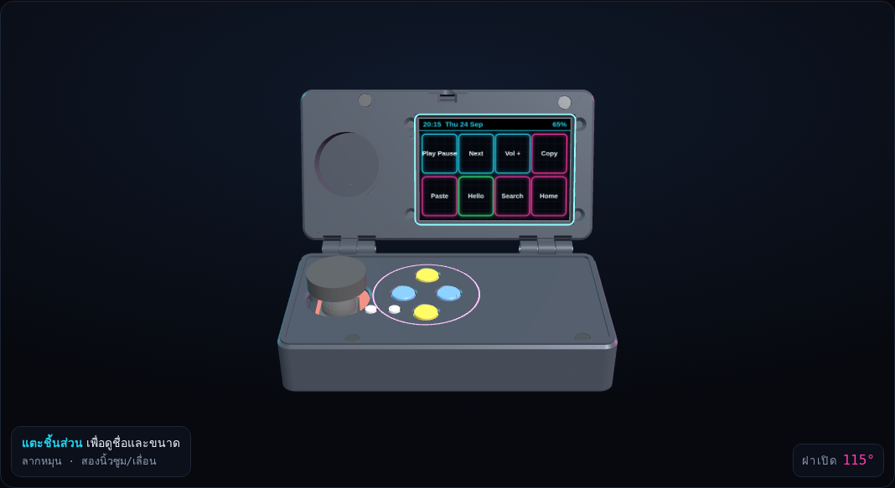
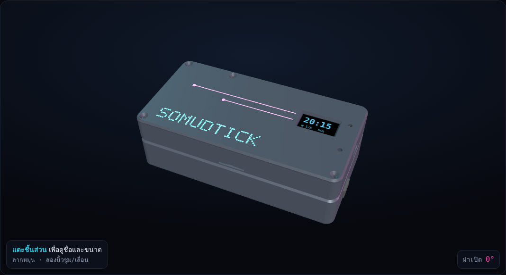
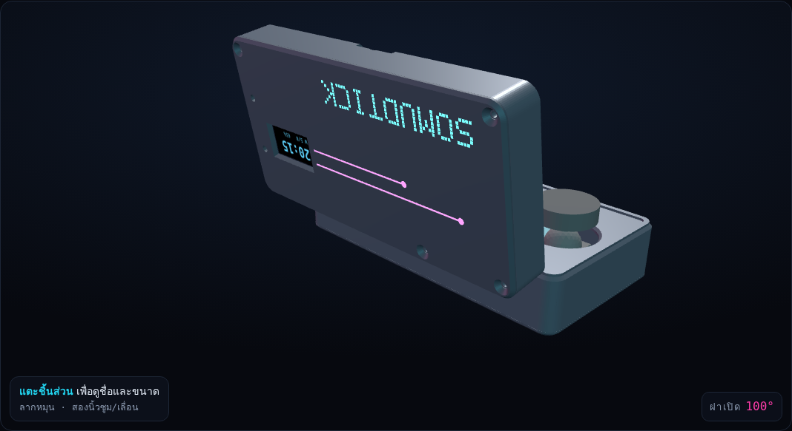
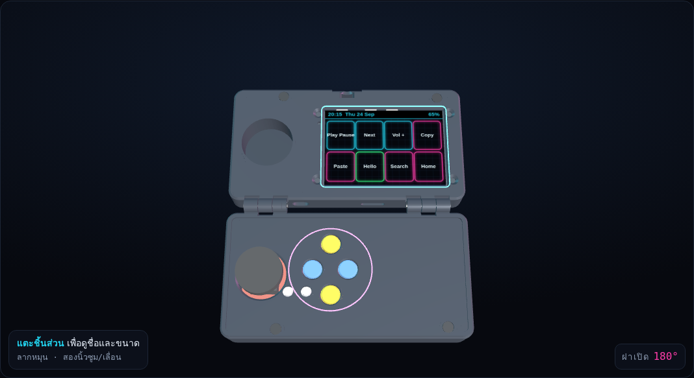
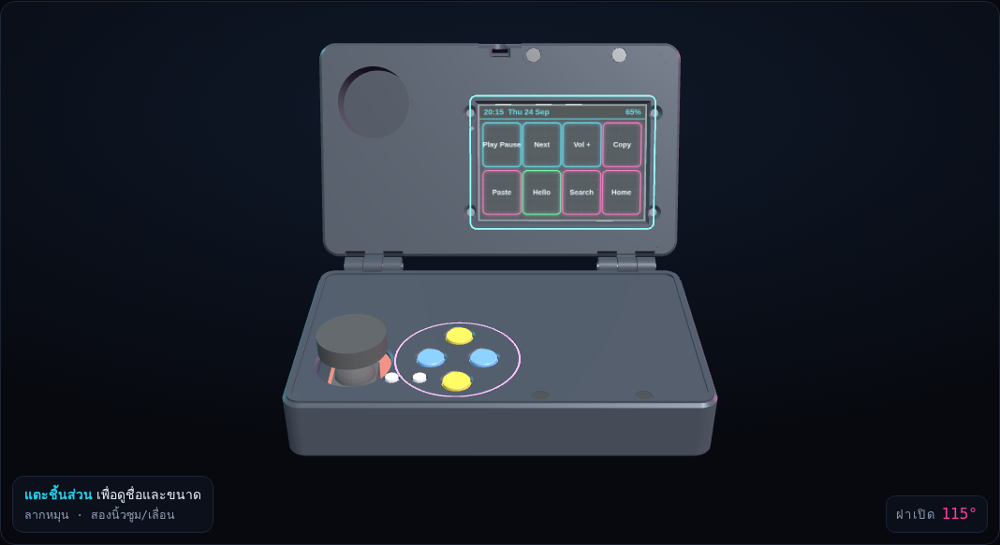
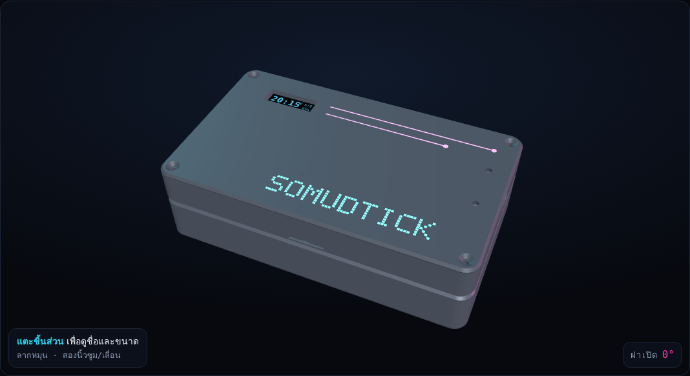
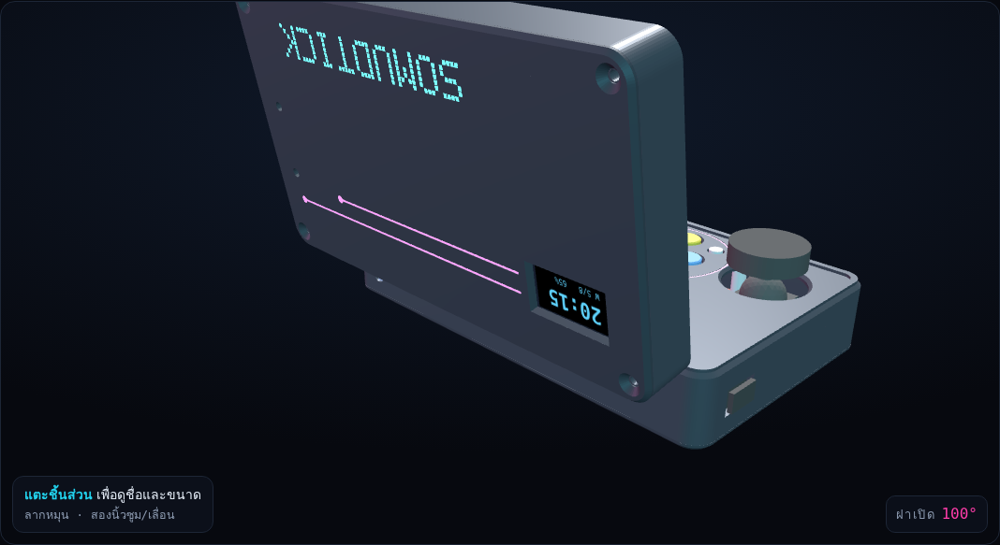
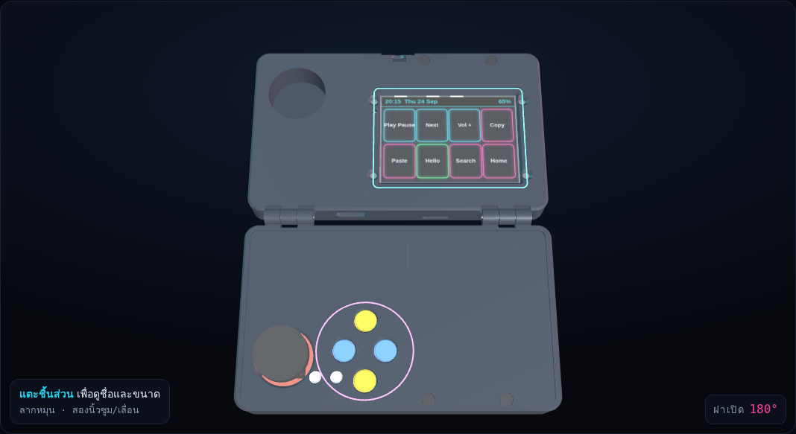

# กล่อง SomudTick DS

มี 2 ขนาด ใช้โค้ดสร้างชุดเดียวกัน:

| รุ่น | ปิดฝา | ใส่อะไร | ไฟล์ |
|---|---|---|---|
| **Mini ⭐ (ของที่มีตอนนี้)** | **136 × 70 × 43 มม.** | แผงจอยแดง, จอ ES3C28P (ไม่ใส่อะคริลิก), จอ OLED, แบต, ลำโพง + PCF8574 + สวิตช์ | `stl_mini/`, `somudtick_mini_3d.html` |
| ใหญ่ | 152 × 90 × 43 มม. | ทุกอย่างของ Mini + DS3231 + IR + อะคริลิกหน้าจอ | `stl/`, `somudtick_ds_3d.html` |

## รุ่น Mini
เล็กกว่ารุ่นใหญ่: พื้นที่ด้านบนน้อยลง **30%** (กว้างลด 16 มม., ลึกลด 20 มม.)

| ถือเล่น | ปิดฝา |
|---|---|
|  |  |
| **บานพับ** | **กางราบ** |
|  |  |

**ต่างจากรุ่นใหญ่ตรงไหน**
- **จอไม่ใส่แผ่นอะคริลิก:** กระจกจอแนบหลังหน้าฝาบนเลย ยึดด้วยน็อต M3 หัวจม 4 ตัวจากด้านหน้าเข้าเสาทองเหลืองเดิม
  - ⚠️ ขันพอตึง อย่าขันแน่นจนจอร้าว
- **PCF8574 กับจอ OLED อยู่หลังบอร์ดจอในฝาบน** (ห่างหลังบอร์ด 3 มม.)
- **ไม่มี DS3231 และ IR** (เวลาใช้ Wi-Fi / มือถือแทน ตามลำดับเดิม) ถ้าจะใส่ทีหลังต้องใช้รุ่นใหญ่
- **สวิตช์อยู่ผนังขวา** ของตัวล่าง
- **ช่องการ์ด SD อยู่ขอบบานพับ** ของฝาบน เสียบได้ง่ายขึ้น (ห่างขอบแค่ 6 มม.)
- **น็อตฝาใต้และฝาหลังเป็น M2.5** (เสาเล็กลงให้ของเข้าได้)
- **สายข้ามบานพับประมาณ 15 เส้น:** ปุ่ม 6 + GND, จอย 3 + 3.3V, ลำโพง 2, แบต 2 (PCF8574 อยู่ฝาบน สายปุ่มเลยต้องข้ามมา)

**ตรวจด้วยโปรแกรมแล้ว (ตามขนาดประมาณ):** ไม่มีชิ้นไหนชนกัน, เปิดฝา 0–180° ไม่ติด, หัวจอยเหลือที่ว่างในหลุม 4 มม. ตอนปิดฝา

✅ **เช็คก่อนส่งพิมพ์:** `cd src && CASE=layout_mini python3 build_ds.py` ต้องไม่มี `CLASH` และ `CASE=layout_mini python3 sweep_check.py` ต้องได้ `0.00` ทั้ง 2 บรรทัด
❌ ถ้ามี `CLASH` ส่งข้อความมาให้ผมดู

**ต้องวัดเพิ่มสำหรับรุ่น Mini** (นอกจากตารางด้านล่าง)
- ความหนาจอ: หน้ากระจกถึงหลังบอร์ด (`PCB_BACK` ตอนนี้ 6 มม.)
- อุปกรณ์ที่สูงที่สุดหลังบอร์ดตรงกลาง: ต้องไม่เกิน 3 มม. เพราะ OLED กับ PCF8574 วางอยู่หลังตรงนั้น

**ของที่ต้องซื้อเพิ่ม (Mini)**
- น็อต M3 × 25 + หัวน็อต 2 ชุด (บานพับ)
- น็อตเกลียวปล่อย M2.5 × 8 ×8
- น็อต M3 × 8 หัวจม ×4 (ยึดจอ)
- แม่เหล็ก 6 × 3 มม. ×4
- สายซิลิโคนประมาณ 15 เส้น

---

# รุ่นใหญ่ (รายละเอียดเดิม)

## กล่อง SomudTick DS (ฝาพับ แบบ Nintendo DS)

กล่องพิมพ์ 3D แบบฝาพับ:
- **ฝาบน:** จอใหญ่ 2.8" อยู่ด้านใน และ**จอเล็ก OLED อยู่ด้านนอก** (ปิดฝาแล้วยังเห็นเวลา)
- **ตัวล่าง:** แผง Joystick Shield ทั้งแผ่น (จอย + ปุ่ม 6 ปุ่ม), แบต, ลำโพง, DS3231, PCF8574, IR, สวิตช์

แบบกล่องเดิม (`SomudTick_case`) ยังอยู่ครบ ไม่ได้แก้

| | ขนาด |
|---|---|
| ปิดฝา | **152 × 90 × 43 มม.** (ข้อบานพับยื่นออกด้านหลังอีก 8 มม.) |
| ตัวล่าง / ตัวบน | สูง 25 / 18 มม. |
| พลาสติกรวม | ประมาณ 140 ซม³ |

ดูโมเดล 3D ได้ที่ `somudtick_ds_3d.html` เปิดในเบราว์เซอร์ (ต้องต่อเน็ต)
- ลากเพื่อหมุน
- เลื่อน "เปิดฝา" 0–180°
- แตะชิ้นส่วนเพื่อดูชื่อและขนาด
- เลื่อน "แยกชิ้น" เพื่อดูข้างใน

| ถือเล่น | ปิดฝา |
|---|---|
|  |  |
| **บานพับ** | **กางราบ** |
|  |  |

---

## จุดเด่นของแบบนี้
- **ปิดฝาแล้วจอยไม่ชนจอ:** ฝาบนมี "หลุม" ลึก 16 มม. รับหัวจอยพอดีตอนปิด (ตรวจด้วยโปรแกรมแล้ว จอยสูงสุด 36 มม. ยังไม่ชน)
- **ปิดฝาแล้วไม่กดปุ่ม:** ขอบตัวล่างยกสูง 1 มม. ฝาบนวางบนขอบนี้ ปุ่มโผล่แค่ 0.6 มม. จึงไม่โดนกด
  - กันกดในกระเป๋าได้ 100% (หน้าจอและปุ่มอยู่ข้างในหมด)
- **เปิดได้ 0–180° ไม่ติดตรงไหน:** ตรวจการชนทุก 5° แล้ว
- **แม่เหล็ก 4 เม็ด:** ปิดฝาแล้วดูดติด ไม่ต้องมีตัวล็อก
- **ลายเรืองแสง:** ร่องลึก 0.5 มม. ทาสีได้
  - กรอบรอบจอ, วงรอบปุ่ม
  - ตัวอักษรพิกเซล **SOMUDTICK** และเส้นหลังฝา
  - ในโมเดลโชว์แบบทาสีฟ้า/ชมพูแล้ว
- **IR อยู่ขอบบานพับ:** ถือแล้วชี้ไปข้างหน้าเหมือนรีโมท

---

## ⚠️ ต้องวัดของจริงก่อนพิมพ์
ตัวเลขเหล่านี้ประมาณจากรูปในร้าน ถ้าผิดจะพิมพ์แล้วใส่ไม่ได้ ของมาถึงแล้ววัดส่งมาให้ผมแก้ หรือแก้เองใน `src/layout_ds.py`

| วัดอะไร | ตัวแปร | ตอนนี้ใช้ |
|---|---|---|
| จอย: ใต้แผงถึงยอดหัวจอย | `STICK_H` | 33 มม. |
| ปุ่มใหญ่: บนแผงถึงยอดหมวกสี | `BTN_H` | 15 มม. |
| ปุ่มเล็ก E, F: บนแผงถึงยอดปุ่ม | `SMALL_H` | 5 มม. |
| ตำแหน่งจอยและปุ่มบนแผง (วัดจากขอบซ้าย, ขอบด้านช่อง Nokia) | `STICK_ON`, `BTN_ON`, `SMALL_ON` | จากรูปร้าน |
| บอร์ด PCF8574 กว้าง × ยาว | `PCF` | 36 × 20 มม. |

✅ **เช็คก่อนส่งพิมพ์:** รัน `python3 src/build_ds.py` แล้วต้องไม่มีบรรทัด `CLASH` จากนั้นรัน `python3 src/sweep_check.py` ต้องได้ `0.00` ทั้ง 2 บรรทัด
❌ ถ้ามี `CLASH` แปลว่าชิ้นส่วนชนกัน ส่งข้อความนั้นมาให้ผมดู

---

## ชิ้นที่ต้องพิมพ์ (โฟลเดอร์ `stl/`)
| ไฟล์ | คืออะไร | จำนวน | วางบนถาด |
|---|---|---|---|
| `base_shell.stl` | ตัวล่าง (หน้าปุ่ม) | 1 | คว่ำหน้าปุ่มลงถาด |
| `base_floor.stl` | ฝาใต้ + ตะแกรงลำโพง | 1 | ด้านเรียบลงถาด |
| `lid_shell.stl` | ตัวบน (หน้าจอ) | 1 | คว่ำหน้าจอลงถาด |
| `lid_back.stl` | ฝาหลัง + ช่อง OLED + โลโก้ | 1 | ด้านโลโก้ลงถาด |
| `btn_cap.stl` | หมวกปุ่ม A B C D | 4 | ตั้งตรง (พิมพ์สีเหลือง 2 น้ำเงิน 2 ได้) |
| `small_cap.stl` | แกนปุ่ม E F | 2 | ตั้งตรง |

**ค่าที่บอกร้านพิมพ์**
- วัสดุ: PETG (ทนร้อน) หรือ PLA สีดำ/เทาเข้ม
- ชั้น 0.2 มม., ผนัง 3 เส้น, ไส้ใน 20%
- **ซัพพอร์ต: เฉพาะใต้ข้อบานพับ** (ข้อบานพับยื่นเลยหน้าเรียบ 4 มม.) ที่อื่นไม่ต้องใช้

---

## ของที่ต้องซื้อเพิ่ม
- น็อต M3 × 25 + หัวน็อต M3 จำนวน 2 ชุด (แกนบานพับ 2 ข้าง)
- น็อตเกลียวปล่อย M3 × 8 จำนวน 8 ตัว (ฝาใต้ 4 + ฝาหลัง 4)
- น็อต M3 × 10 จำนวน 4 ตัว (ยึดจอกับหน้าฝาบน เข้าเสาทองเหลืองเดิม)
- แม่เหล็กกลม 6 × 3 มม. จำนวน 4 เม็ด (ติดกาวร้อน **หันขั้วให้ดูดกัน** ลองก่อนติด)
- สายไฟอ่อน (ซิลิโคน 26–28 AWG) ข้ามบานพับ 12 เส้น
- สีอะคริลิกเรืองแสง ฟ้า/ชมพู (ถ้าอยากทาลาย)

---

## เดินสาย
**สายที่ข้ามบานพับ 12 เส้น** (ผ่านช่องกลางขอบบานพับ ทั้งตัวล่างและตัวบน)

| สาย | จากตัวล่าง | ไปตัวบน (บอร์ด ES3C28P) |
|---|---|---|
| 3.3V, GND, SDA, SCL | DS3231, PCF8574, จอย, IR | ช่อง I2C (IO16 SDA, IO15 SCL) |
| X, Y, กดจอย | จอยบนแผง | ช่อง IO: IO2, IO3, IO14 |
| สัญญาณ IR | KY-005 ขา S | IO21 |
| ลำโพง 2 เส้น | ลำโพง | ช่อง SPEAKER |
| แบต 2 เส้น (ผ่านสวิตช์) | แบต + สวิตช์ | ช่อง BAT |

- **ปุ่ม A–F → PCF8574 P0–P5**, PCF8574 ต่อสาย I2C (เลขที่อยู่ 0x20)
- **จอ OLED อยู่ฝาบน:** ต่อสาย I2C แยกจากฝั่งบอร์ดได้เลย (เลขที่อยู่ 0x3C)
- เลขที่อยู่ I2C ทั้งหมดไม่ชนกัน: 0x38 ทัช, 0x18 เสียง, 0x68 นาฬิกา, 0x57 EEPROM, 0x20 ปุ่ม, 0x3C จอเล็ก
- ⚠️ ทุกอย่างใช้ **3.3V** และต้องสับสวิตช์บนแผง Joystick Shield ไปที่ **3V3**
- ⚠️ เหลือสายหย่อนตรงบานพับประมาณ 3 ซม. ไม่งั้นเปิดปิดบ่อยแล้วสายจะขาด

✅ **เช็ค:** เปิดฝาสุด 180° แล้วสายยังไม่ตึง
❌ ถ้าสายตึง ให้ต่อสายให้ยาวขึ้น อย่าฝืนเปิด

---

## ประกอบ
⚠️ ถอดแบตและสาย USB ก่อนทำ

1. **ตัวบน:** วางจอคว่ำลงหน้าฝา ให้ USB-C ชิดผนังขวา ขันน็อต M3 × 10 จากด้านหน้าเข้าเสาทองเหลือง 4 ตัว
   ✅ **เช็ค:** มองจากหน้าเห็นจอเต็มช่อง, เสียบ USB-C ได้สุด, เสียบการ์ด SD ผ่านช่องขอบบานพับได้ (ใช้ปลายแหนบดัน)
2. **OLED:** ถอดขาก้างปลาของจอ OLED ออก บัดกรีสายตรง ๆ วางลงกรอบในฝาหลัง ให้ส่วนจอตรงช่อง แล้วหยดกาวร้อนที่มุม
3. **ตัวล่าง:** ถอดขาก้างปลาด้านล่างของแผง Joystick Shield ออก วางบนเสา 4 เสาในฝาใต้ ปิดด้วยตัวล่าง
   ✅ **เช็ค:** ใส่หมวกปุ่มที่พิมพ์ กดแล้วได้ยินเสียงคลิกทุกปุ่ม และหัวจอยโยกได้รอบทิศไม่ชนขอบรู
   ❌ ถ้ากดปุ่มไม่ติด แปลว่าปุ่มจริงเตี้ยกว่า 15 มม. ให้แก้ `BTN_H` แล้วพิมพ์หมวกปุ่มใหม่ (ชิ้นเล็ก พิมพ์ไม่กี่นาที)
4. **แบต ลำโพง DS3231 PCF8574 KY-005:** วางตามช่องในฝาใต้ (มีขอบกั้นแบตกับลำโพง) ใช้เทปโฟมสองหน้า
   - หน้าลำโพงหันลงตะแกรง
   - หลอด IR ดัดให้ชี้ออกรูขอบบานพับ
5. **บานพับ:** ร้อยน็อต M3 × 25 จากด้านนอก ขันหัวน็อตในช่องหกเหลี่ยม **อย่าขันแน่นจนฝาหนืด**
6. **แม่เหล็ก:** ติดกาวร้อนในหลุม 4 หลุม (ตัวล่าง 2, ตัวบน 2) ลองดูขั้วก่อนว่าดูดกัน
7. **ปิด:** ขันฝาใต้และฝาหลังด้วยน็อตเกลียวปล่อย M3 × 8
   ✅ **เช็คสุดท้าย:**
   - ปิดฝาแล้วดูดติด และไม่มีปุ่มถูกกด (จอไม่ติดเอง)
   - เปิดสวิตช์แล้วจอติด
   - ตั้ง Settings → Screen เป็นแนวนอน
   ❌ ถ้าภาพกลับหัว ให้เลือกแนวนอนอีกด้าน (จอติดตั้งแบบหมุนข้าง)

**เรื่องเฟิร์มแวร์:** จอ OLED กับปุ่มผ่าน PCF8574 **ยังไม่มีโค้ด** จะทำในเวอร์ชันถัดไปเมื่อของมาถึงและต่อสายเสร็จ

---

## ถ้าอยากแก้ขนาด
ตัวเลขทุกอย่างอยู่ใน `src/layout_ds.py` ที่เดียว แก้แล้วรันตามลำดับ:
```
pip install manifold3d trimesh numpy pillow
cd src
python3 build_ds.py        # STL (out/) + ตรวจการชน
python3 sweep_check.py     # ตรวจการเปิดฝา 0-180° และจอยตอนปิดฝา
python3 make_viewer_ds.py  # หน้าโมเดล 3D

# รุ่น Mini
CASE=layout_mini python3 build_ds.py
CASE=layout_mini python3 sweep_check.py
python3 make_viewer_ds.py mini
```
แล้วคัดลอก `src/out/*.stl` ไป `stl/` และ `src/out/somudtick_ds_3d.html` มาไว้ที่นี่

## ไฟล์ในโฟลเดอร์นี้
| ไฟล์ | คืออะไร |
|---|---|
| `stl/*.stl` | ไฟล์ส่งร้านพิมพ์ 6 ชิ้น (รุ่นใหญ่) |
| `stl_mini/*.stl` | ไฟล์ส่งร้านพิมพ์ 6 ชิ้น (รุ่น Mini) |
| `somudtick_mini_3d.html` | โมเดล 3D รุ่น Mini |
| `src/layout_mini.py` | ขนาดรุ่น Mini (แก้เฉพาะที่ต่างจากรุ่นใหญ่) |
| `somudtick_ds_3d.html` | โมเดล 3D หมุนดู เปิดฝาได้ |
| `images/case_*.png` | ภาพโมเดล 4 มุม |
| `src/layout_ds.py` | ขนาดและตำแหน่งทุกอย่าง |
| `src/build_ds.py` | สร้าง STL + ตรวจการชน |
| `src/sweep_check.py` | ตรวจการเปิดฝาและจอย |
| `src/make_viewer_ds.py`, `src/viewer_ds_tpl.html` | สร้างหน้าโมเดล 3D |
| `src/shots_ds.js` | ถ่ายภาพโมเดล (Playwright) |

## ศัพท์ในเอกสารนี้
| คำ | ความหมาย |
|---|---|
| STL | ไฟล์รูปทรง 3D ที่ร้านพิมพ์ใช้ |
| ซัพพอร์ต (support) | โครงรองชั่วคราวใต้ส่วนที่ยื่นลอย พิมพ์เสร็จแล้วแกะทิ้ง |
| ข้อบานพับ (knuckle) | ท่อกลมที่น็อตแกนร้อยผ่าน |
| ขอบยก (rim) | ขอบนูน 1 มม. รอบหน้าตัวล่าง ให้ฝาวางโดยไม่กดปุ่ม |
| CLASH | โปรแกรมเจอชิ้นส่วนชนกัน |
